# AnalyticsICE (In development)

This project was generated with [Angular CLI](https://github.com/angular/angular-cli) version 11.1.0.

## Development server

The following commands need to be invoked for getting the app up & running
* Start the back-end by running `npm run server`
* Start a development version of the app by running `npm start`
* Start Python server by running `python initServer.py` under `scriptsML` folder of the app

Once this three services are up & running, open a new browser (e.g. Chrome) and navigate to `http://localhost:4200/`.
The app will automatically reload if you change any of the source files.

You must have a mysql server, the application will connect and create the necessary tables. You must find `config.son'` in the root of the project and change the username and password that you have in your database. Please do not change the name of the database.

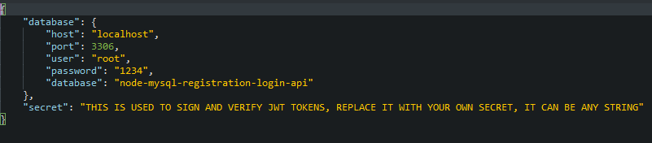

##  Code scaffolding

Run `ng generate component component-name` to generate a new component. You can also use `ng generate directive|pipe|service|class|guard|interface|enum|module`.

## Build

Run `ng build` to build the project. The build artifacts will be stored in the `dist/` directory. Use the `--prod` flag for a production build.

## Running unit tests

Run `ng test` to execute the unit tests via [Karma](https://karma-runner.github.io).

## Running end-to-end tests

Run `ng e2e` to execute the end-to-end tests via [Protractor](http://www.protractortest.org/).

## Further help

To get more help on the Angular CLI use `ng help` or go check out the [Angular CLI Overview and Command Reference](https://angular.io/cli) page.

## User's Guide

Navigate to `http://localhost:4200/`

The first view will be the login view:

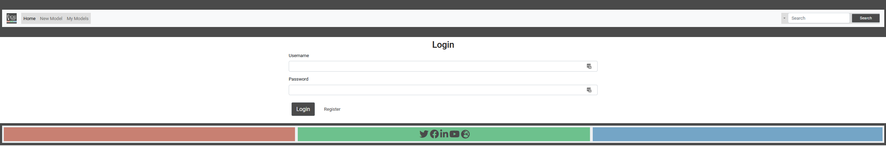

------

First you must register in the system:

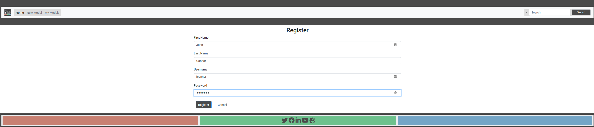

------

Then login:

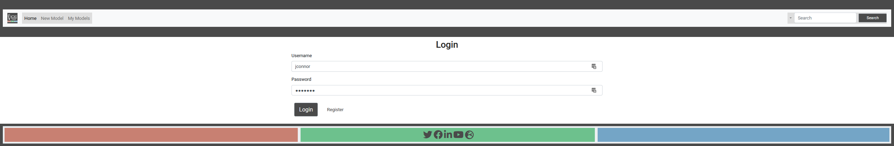

------

In this view you can see that you are already inside the system, this is the section of `New Model`. 

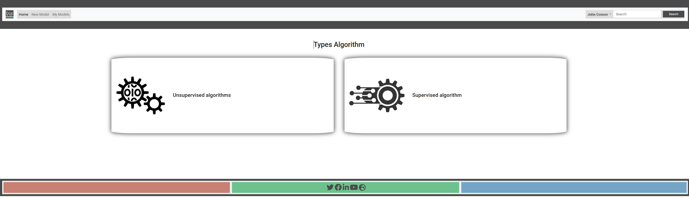

We have two types of supervised and unsupervised algorithms. In our case we chose `nosupervised`, to see an example of how the application works.

------

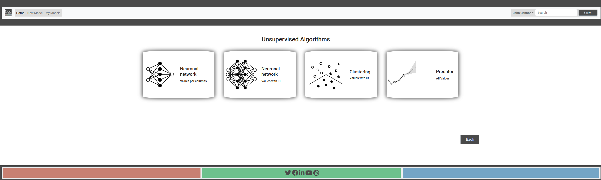

We will choose the first one `Neuronal new - Values per columns`

------

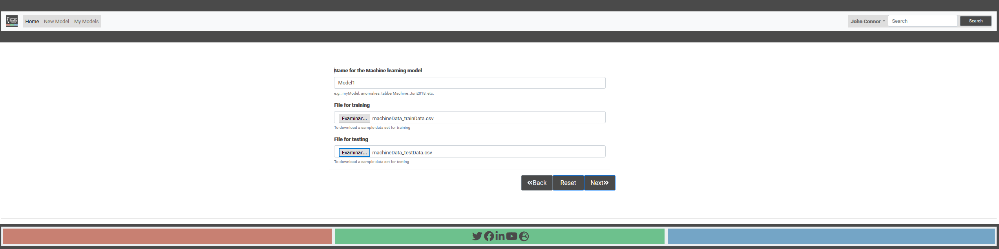

We name the model and add the training and test datasets: Click `Next` to start the data analysis.

------

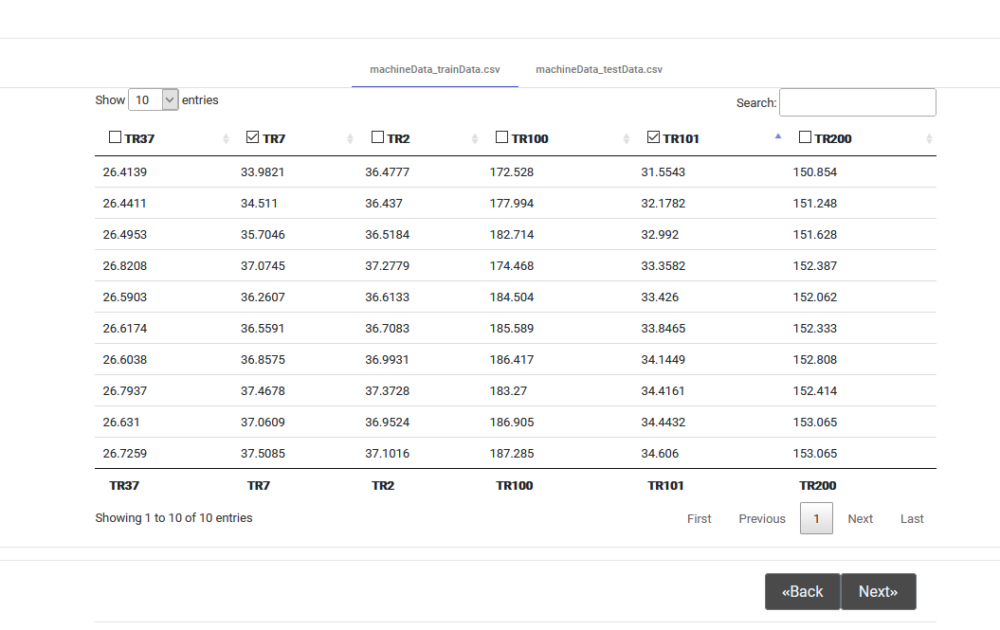

Now we have to choose the columns we want to include in the model. In this case we chose `TR7` and `TR101` and click in `Next` to start next analysis:

------

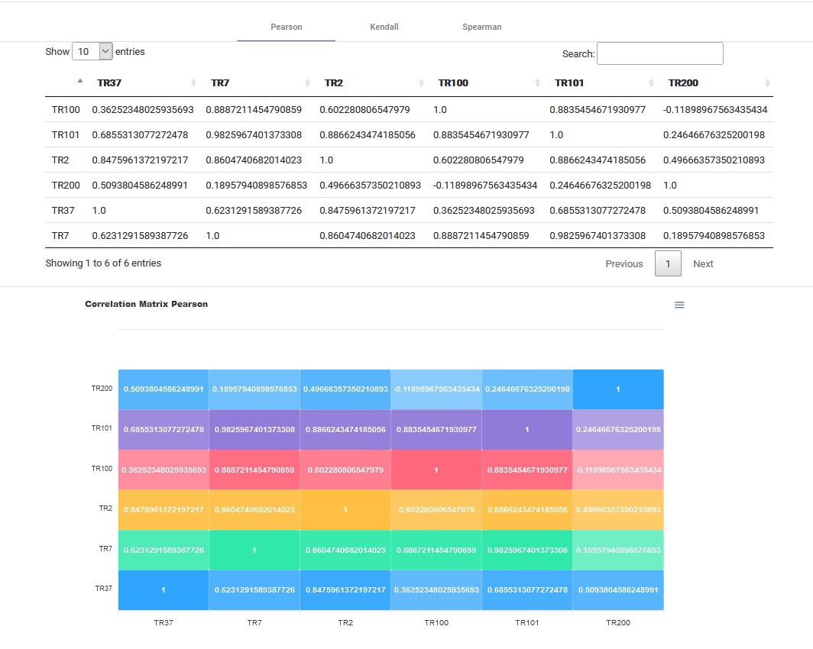

 In this first analysis these correlation tables are generated for all columns.

  - Pearson: The **Pearson correlation coefficient** , also referred to as **Pearson's \*r\***, the **Pearson product-moment correlation coefficient** (**PPMCC**), or the **bivariate correlation**, is a measure of [linear](https://en.wikipedia.org/wiki/Linear) [correlation](https://en.wikipedia.org/wiki/Correlation_and_dependence) between two sets of data. It is the [covariance](https://en.wikipedia.org/wiki/Covariance) of two variables, divided by the product of their [standard deviations](https://en.wikipedia.org/wiki/Standard_deviation); thus it is essentially a normalised measurement of the covariance, such that the result always has a value between −1 and 1. As with covariance itself, the measure can only reflect a linear correlation of variables, and ignores many other types of relationship or correlation. As a  simple example, one would expect the age and height of a sample of  teenagers from a high school to have a Pearson correlation coefficient  significantly greater than 0, but less than 1 (as 1 would represent an  unrealistically perfect correlation). https://en.wikipedia.org/wiki/Pearson_correlation_coefficient.
  - Kendall: the **Kendall rank correlation coefficient**, commonly referred to as **Kendall's τ coefficient** (after the Greek letter [τ](https://en.wikipedia.org/wiki/Τ), tau), is a [statistic](https://en.wikipedia.org/wiki/Statistic) used to measure the [ordinal association](https://en.wikipedia.org/wiki/Ordinal_association) between two measured quantities. A **τ test** is a [non-parametric](https://en.wikipedia.org/wiki/Non-parametric_statistics) [hypothesis test](https://en.wikipedia.org/wiki/Hypothesis_test) for statistical dependence based on the τ coefficient. https://en.wikipedia.org/wiki/Kendall_rank_correlation_coefficient
  - Spearman: **Spearman's rank correlation coefficient** or **Spearman's \*ρ\***, named after [Charles Spearman](https://en.wikipedia.org/wiki/Charles_Spearman)  is a [nonparametric](https://en.wikipedia.org/wiki/Nonparametric_statistics) measure of [rank correlation](https://en.wikipedia.org/wiki/Rank_correlation) ([statistical dependence](https://en.wikipedia.org/wiki/Correlation_and_dependence) between the [rankings](https://en.wikipedia.org/wiki/Ranking) of two [variables](https://en.wikipedia.org/wiki/Variable_(mathematics)#Applied_statistics)). It assesses how well the relationship between two variables can be described using a [monotonic function](https://en.wikipedia.org/wiki/Monotonic_function). https://en.wikipedia.org/wiki/Spearman%27s_rank_correlation_coefficient

------

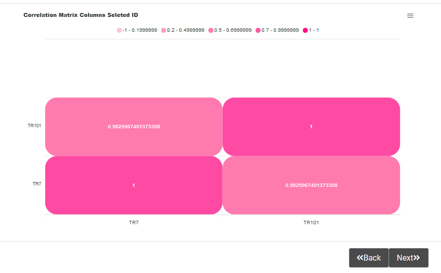

This image is the Pearson correlation table, but only for the columns chosen for inclusion in the model. To continue with the analysis we click `Next`.

------

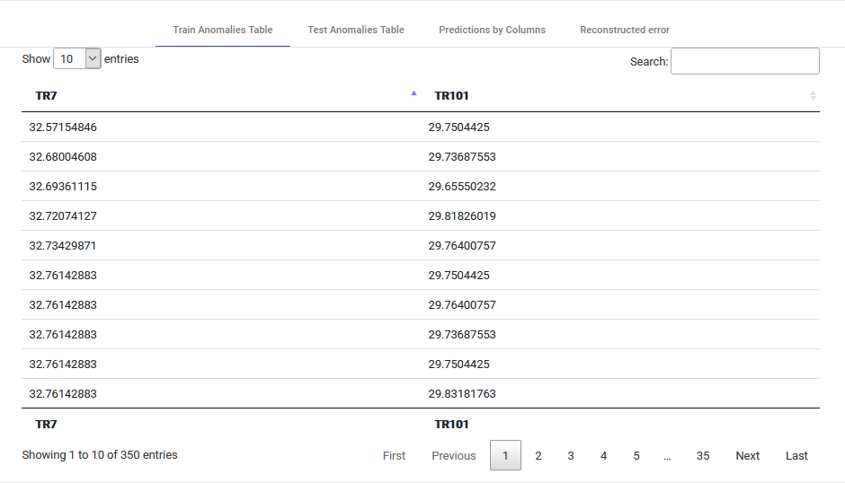

Here are the final results of the model:

- Anomalies in the test table.
- Anomalies in the training table.
- Predictions for all columns.
- MSE Reconstructed Error.

------

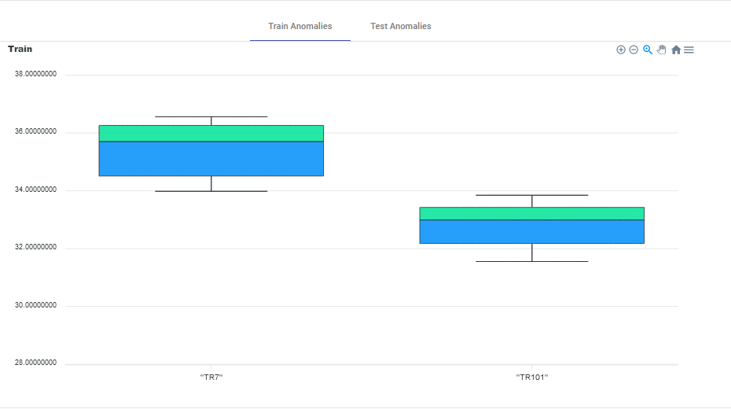

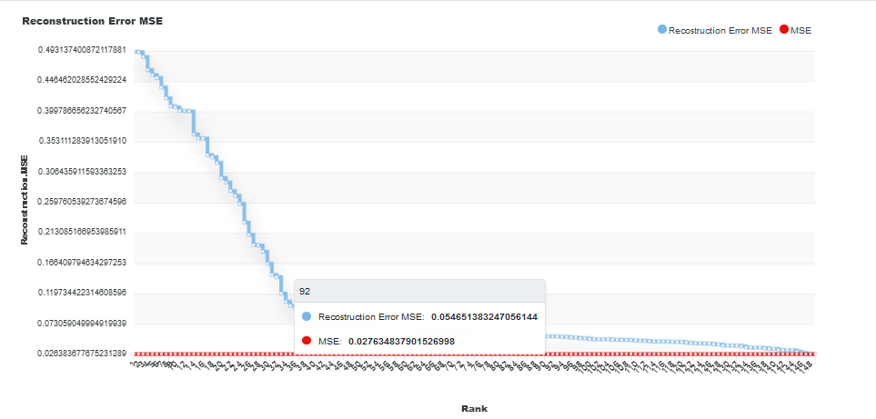

The same as those shown in tables, in graphs, which are easier to analyse and understand.

The model is saved and created in our workspace.

------

To be able to revisit our model, we will have to go to the `My Models` section in the taskbar above.

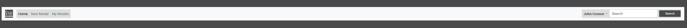

Click on My Models and we will see all our models created in our workspace.

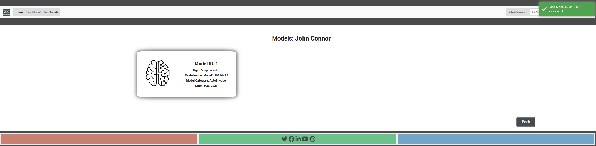

  If we click on one of the models already created, we will be able to see its data.

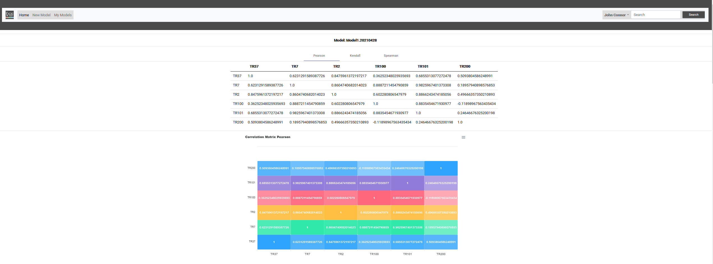

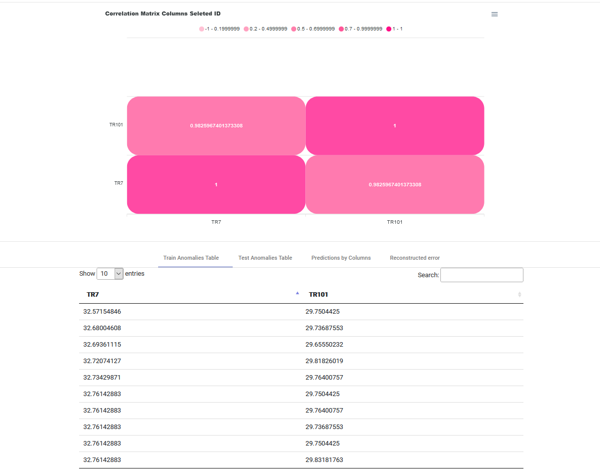

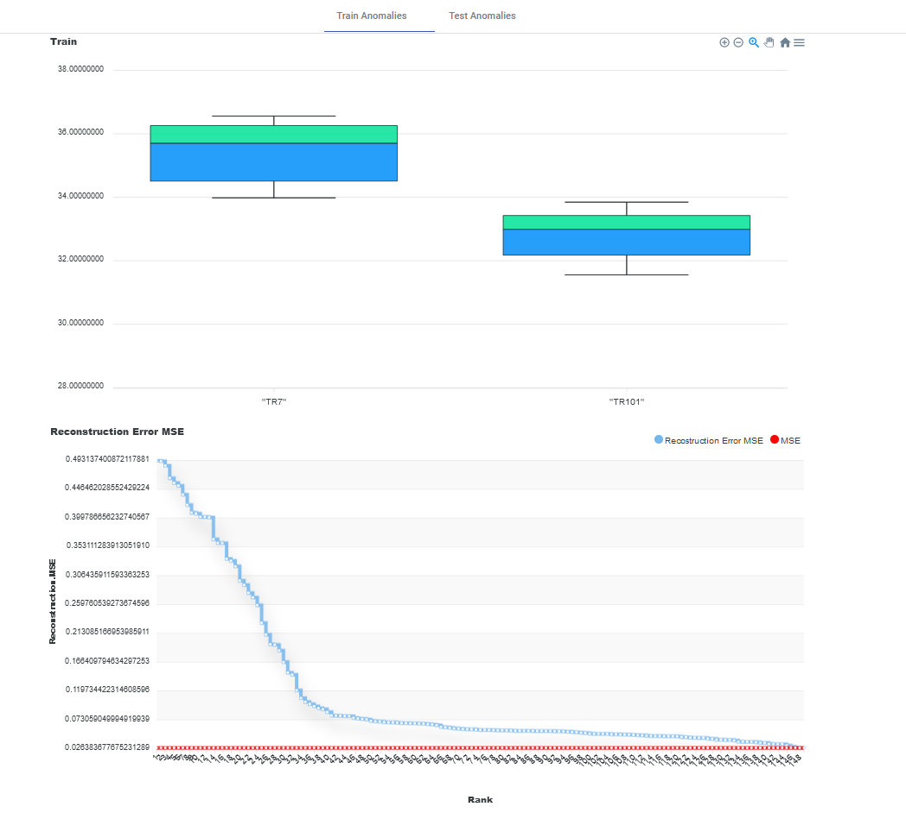

------

## Account administration

We log in to our user, in our case `John Connor`

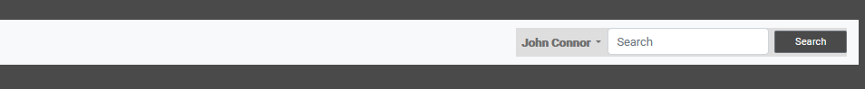

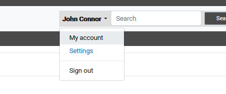

Select `My Account`

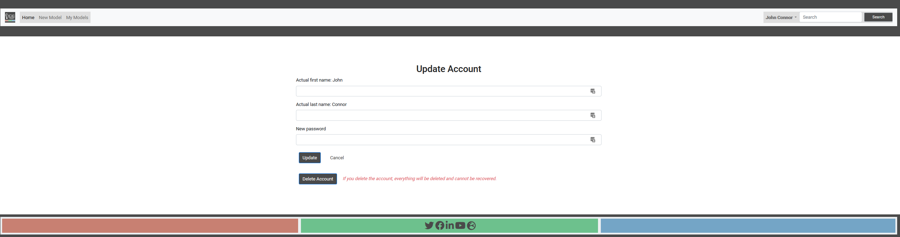

We see this view, here we can modify our data or delete our user. (under development)